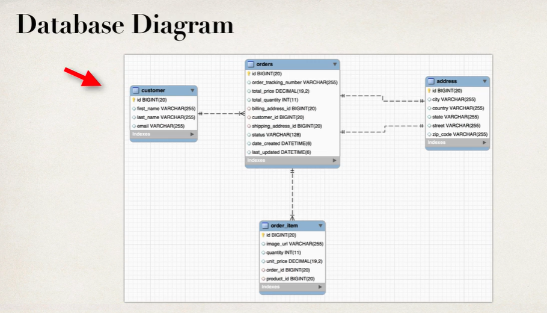
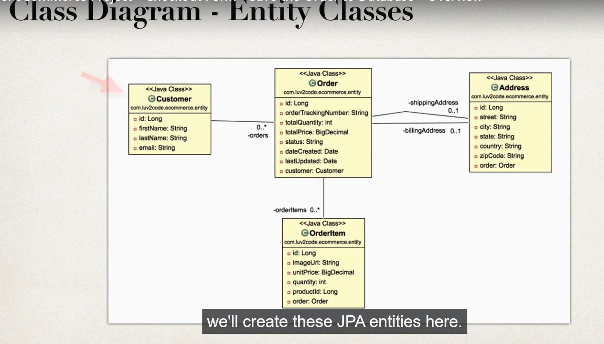
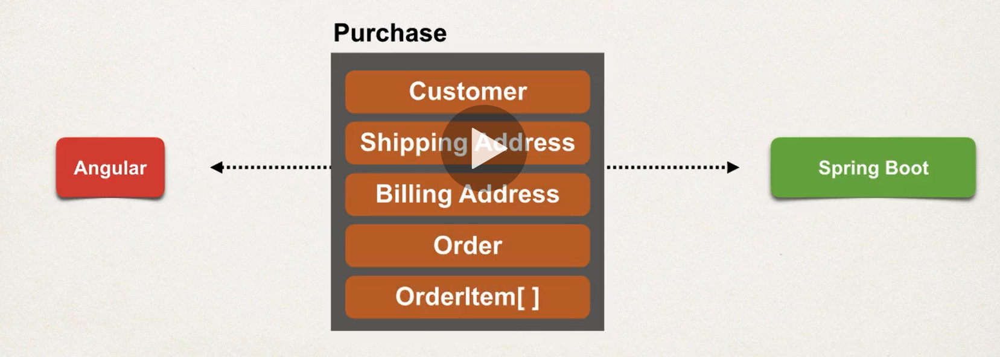
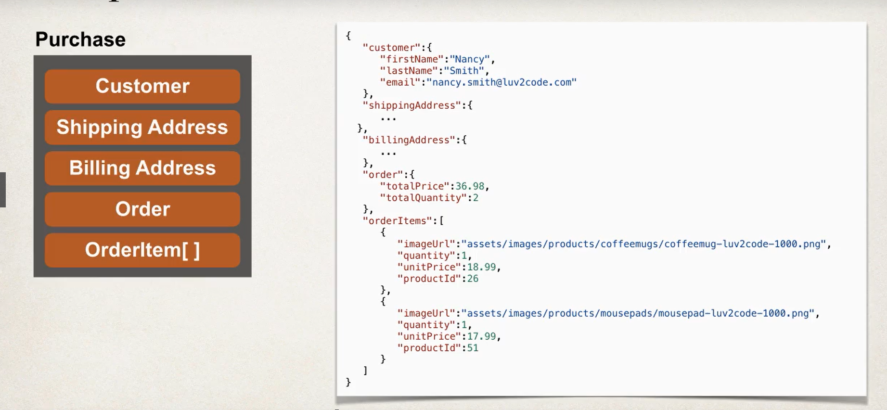
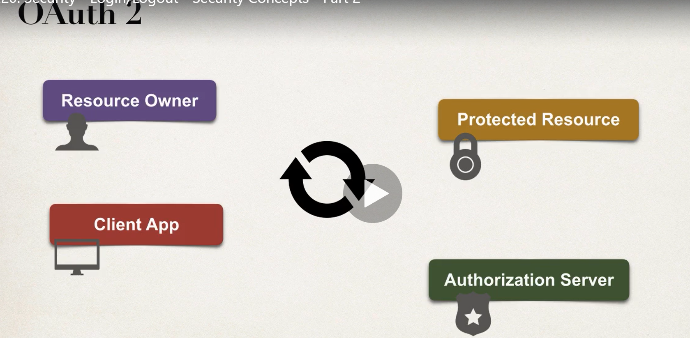
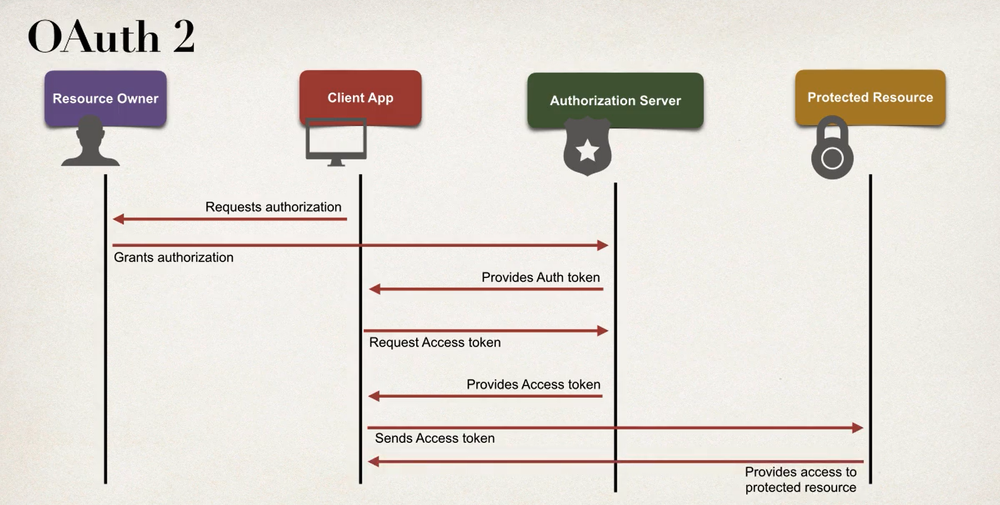
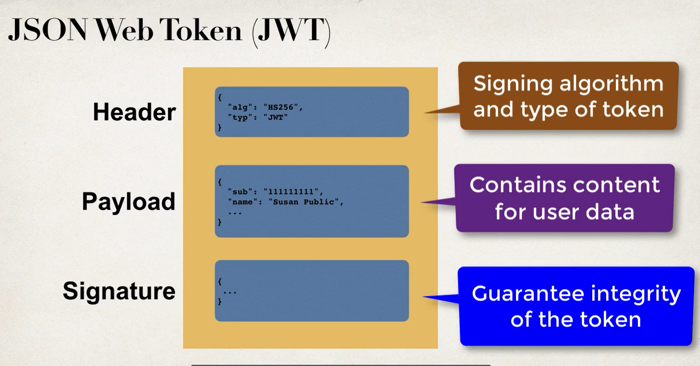

# Fullstack-Ecommerce-Project
STEPS:
1. setup db tables(create-user.sql(creates a new user),create-products.sql(creates a schema, and inside that schema 2 tables product and procuct_category))

2. start.spring.io spring-boot-starter-data-jpa(Spring Data JPA(dependency name in start.spring.io)), spring-boot-starter-data-rest(Rest Repositiories), mysql-connector-java(MySQL Driver), lombok(for getter and setters and other boilerplate code).<br>Created application.properties file with required db config.<br> Created JPA Entities for db tables.<br> Created REST APIs with Spring Data JPA repositories(interfaces in DAO) and  Spring Data REST.Used Spring Data JPA(Persist data in SQL stores with Java Persistence API using Spring Data and Hibernate), Lombok, Rest Repositories(Exposing Spring Data repositories over REST via Spring Data REST) and MYSQL Driver dependencies. <br>The dialect specifies the type of database used in hibernate so that hibernate generate appropriate type of SQL statements. For connecting any hibernate application with the database, it is required to provide the configuration of SQL dialect.<br>In computer software, a data access object (DAO) is a pattern that provides an abstract interface to some type of database or other persistence mechanism. By mapping application calls to the persistence layer, the DAO provides some specific data operations without exposing details of the database.The Data Access Object (DAO) pattern is a structural pattern that allows us to isolate the application/business layer from the persistence layer (usually a relational database, but it could be any other persistence mechanism) using an abstract API.The functionality of this API is to hide from the application all the complexities involved in performing CRUD operations in the underlying storage mechanism. This permits both layers to evolve separately without knowing anything about each other.

3. RELEASE 1.0: created product-list componenet to get lists of product via a service. creqate a Product class to represent Product[] coming from BE.

```
Release 1.0.0<br/>
Make REST APIs Read Only. So onlt GET requests are allowe else you will get 405 Method Not Allowed.<br/>
Possible Solutions:<br>
1. option 1: Don't use Spring Rest
    1.1 Manually create your own @RestController
    1.2 Manually define methods for GET accesss(@GetMapping)
    1.3 But we lost the Spring Data Rest support for paging, sorting,etc

    /api
    {
  "_links" : {
    "productCategory" : {
      "href" : "http://localhost:8080/api/product-category{?page,size,sort}",
      "templated" : true
    },
    "products" : {
      "href" : "http://localhost:8080/api/products{?page,size,sort}",
      "templated" : true
    },
    "profile" : {
      "href" : "http://localhost:8080/api/profile"
    }
  }
}

2. Option 2: Use Spring Data REST
    2.1 Configure to disbale required HTTP methods
```

4. RELEASE 2.0: Used HTML template from starter files and integrated the shop view into angular. installed boostrap and font-awesome locally via npm.

5. Added Search for product by category(not related to search bar, these are links in the sidenav, when you click on them, main grid will show products of that category). Route: /category/id or /category(in this case use deafult id). Product List componenet(simple table in release 1.0 but now a whole grid of products) gets product for given categry from BE(the BE returned products regardless of category so added new query method findByCategoryId to REST repo and Spring Data REST automatically expose end pts for query methods under api/products/search/querymethodname?paramlist). Currently i was just hardcoding the ids(category names and ids are static) in UI in sdienav(routerlink="category/1", etc). 
```
Spring Data Rest and Spring Data JPA supports query methods. Spring will construct a query based on method naming conventions. Ex findBy, readBy, queryBy,etc

Page<Product> findByCategoryId(@RequestParam("id") Long id, Pageable pageable); ===> spring will build and execute a query SELECT * FROM PRODUCT WHERE CATEGORY_ID=?;

If you don't want the query bbuilt by spring, you can use @Query annotation to build your own custom query for REST repo method. 
```

6. Made modification in BE to support getting list of categories(names and ids and other info) via REST apis. Expose Entity ids(by updating spring data rest cinfig and using JPA Entity Manager), create class ProductCategory in FE, create new Menu componenent for categoriy list in  sidenav.

```
By default, Spring Data REST does not expose entity ids. We need entity ids. We need enity  ids for: Get a list of product categories by id, master/detail view to get a given product by id. http://localhost:8080/api/product-category<br>
{
  "_embedded" : {
    "productCategory" : [ {
      "categoryName" : "Books",
      "_links" : {
        "self" : {
          "href" : "http://localhost:8080/api/product-category/1" //hateos link
        },
        "productCategory" : {
          "href" : "http://localhost:8080/api/product-category/1"
        },
        "products" : {
          "href" : "http://localhost:8080/api/product-category/1/products"
        }
      }
    },...
}
There is no entity id at the productcategory level,but, enitity id is embedded in the hateos links. But no easy access, Requires parsing url string. Not ideal. I want the api response to include categoryid and Category Name at category Level only for dyanmic listing of categories in FE.
{
  "_embedded" : {
    "productCategory" : [ {
      "id" : 1, // here
      "categoryName" : "Books",
      "_links" : {
        "self" : {
          "href" : "http://localhost:8080/api/product-category/1"
        },
        "productCategory" : {
          "href" : "http://localhost:8080/api/product-category/1"
        },
        "products" : {
          "href" : "http://localhost:8080/api/product-category/1/products"
        }
      }
    },...}
```

7. Added functionality for search products by keyword(search bar). Added new Search method(findByNameContaining) in BE, created new search component,new api method for search, added route for searching(search/:keyword), ProductList componenet still handles  the search results(logic and view reuse for listing products)

8. Created Product details componenet and added api call to get specific product with id.

9. Added Pagination using ng-Bootstrap. added pagination support to ProductService(calls findBycategoryid with page and size parameters). update interface in product.service to map the recieved pagination info.. FLOW: we set new poprties in product list comp that we need to enable pagination, we make api call to get product list for given category id and other pagiantion info, we update the product list data as well as the pagination properties in the componenet.

```
SpringData Rest also send Pagination metadata http://localhost:8080/api/products?pages=0&size=10<br>
{
  "_embedded" : {
    "products" : [ {
      "id" : 1,
      "sku" : "BOOK-TECH-1000",
      "name" : "Crash Course in Python",
      "description" : "Learn Python at your own pace. The author explains how the technology works in easy-to-understand language. This book includes working examples that you can apply to your own projects. Purchase the book and get started today!",
      "unitPrice" : 14.99,
      "imageUrl" : "assets/images/products/books/book-luv2code-1000.png",
      "active" : true,
      "unitsInStock" : 100,
      "dateCreated" : "2021-08-01T02:45:21.000+00:00",
      "lastUpdated" : null,
      "_links" : {
        "self" : {
          "href" : "http://localhost:8080/api/products/1"
        },
        "product" : {
          "href" : "http://localhost:8080/api/products/1"
        },
        "category" : {
          "href" : "http://localhost:8080/api/products/1/category"
        }
      }
    }, ...,
  "page" : {
    "size" : 10, //items per page(default is 20 for Spring Data REST)
    "totalElements" : 100,
    "totalPages" : 10,
    "number" : 0 //page number; for spring pagenumbers are 0 based, while for ng-bootssrap it is 1 based
  }
}

For pagiantion we need implementation on both BE and FE, but Spring data rest manages that for us through
concepts of page and size. In FE, we use ng-boostrap for pagination. We jsut need to map the above
pagination metadata in FE pagination implementation.
```

10. Added pagination for keyword search. add new api call method to search products and send pagination params, actually everything we did above just for handling pagination in searchmode in productlist component.

11. Created shopping cart status componenet and related code. addtocart buttons data stored in service(Subject) which then propagates changes to cartstatus component to update quantity and bill.

12. Created card details component that just recieves info ffrom cart service and shows cart data wiht increment quantity, decrement quantity and remove item buttons.

13. Checkout Form: Reactive Form(Form control: individual control that tracks the value and validation status; FormGroup: a collection of controls, can create nested groups; Formbuilder:to build the form)<br>Populate countries and States from BE api. Added new tables Country(id(pk),code,name) and State(id(pk),name,country_id(fk references country id)). Added new corresponding JPA Entities and repositories.<br> For State repository, added custom query method findByCountryCode(table:country,column:code) because i want to find states by country code and not just all states. Also added config to make apis /country and /state readonly(becuase there is no need for updation).ran the script for countries and states. api/countries returned list of countries and in each country was its assocaited states object. but we didnot want states so we used @JsonIgnore(Reproducing this scenario: Create Entities for Country and State==> create repository interface only for country==> country contains a List<states> so if you got to /api/countire rn, it will ahve the list of all states embedded into each country==>resolve by adding@jsonignore to country entity List<states>).<br> added luv2shopformservice for credit card expiry date and yesrs suggestions(logic here to show months based on selected year).

INSERT INTO country VALUES 
(1,'BR','Brazil'),
(2,'CA','Canada'),
(3,'DE','Germany'),
(4,'IN','India'),
(5,'TR','Turkey'),
(6,'US','United States');

INSERT INTO state VALUES 
(1,'Acre',1),
(2,'Alagoas',1),
(3,'Amapá',1),
(4,'Amazonas',1),
...,
(57,'Andhra Pradesh',4),
(58,'Arunachal Pradesh',4),
(59,'Assam',4),

though we did @jsonignore which only removes list of states from returned json data, but still in DB avery country contains a list of associated states
```
@OneToMany(mappedBy = "country") 
@JsonIgnore 
private List<State> states;
```
so it finds country with given code and returns the lsit of states. but how is this query method present in States repo???


14. Validation for Checkout Page using new FormControls. We also needed to define getter methods to access these customer info FormControls in the HTMl template to get the actual status, list of errors,etc. ex in  template we do, firstName.invalid to check if validation failed. We only dispaly validation error if user has interacted with the form. When the user changes field value, the control is marked as dirty and when the field loses focus, the control is marked as touched.

15. custom Validator Rule: our current form validation for customer info passes if you only use whitespaces to fill firstname and lastname. Created new custom validator class, notOnlyWhiteSpace

16. Added validation for credit card, billing and shipping info section in checkout page

17. Update Cart totals on checkout page: the checkout componenet will subscribe(subscribe to subject in cartservice) to events from CartServcie. However, since checkout componenet is instantiated later in the application, it will miss out on previous messages nad thus cart totals will be 0. So we neeed to get a replay of the missed messages from subject. So we can use ReplaySubject. But actually we only need the last event/msg(last computed total of items in cart) and not any msgs before that. So we use behaviuor subject. it has a notion of current value and stores the latest msg/event and send that to new subs.

18. Saving the order to BE: We wnat to save our cart orders in BE. we made our custom coded Checkout Contoller and custome coded Checkout Service but why not Spring Data Rest. because its only good for baisc crud but its not best for processing the order using custom business logic ==> generate custom tracking number, save order in db and so on; as it is very limited in terms of customization.


We have our ORDERS basically for the given order that we're saving in the db. a CUSTOMER can have 0 to many ORDERS. 2 lines between orders and address mean we have 2 adresses: billig and shipping. ORDERS has a collection of ORDER_ITEMs. 



We will also need to create a data tranfer object Purchase to send data from FE to BE.<br>



BE architecture: CheckoutController==>CheckoutService==>Spring Data JPA Repo(Customer Repository)==>DB

ran the db script #5


POSTMAN /checkout post api data
```
{
   "customer":{
      "firstName":"kunal",
      "lastName":"vtest2",
      "email":"vtest2@vtest2.com"
   },
   "shippingAddress":{
      "street":"vtest2s",
      "city":"vtest2s",
      "state":"tindas",
      "country":"Canada",
      "zipCode":"vtest2s"
   },
   "billingAddress":{
      "street":"vtest2b",
      "city":"vtest2b",
      "state":"tindab",
      "country":"Canada",
      "zipCode":"vtest2b"
      },
   "order":{
      "totalPrice":36.98,
      "totalQuantity":2
   },
   "orderItems":[
      {
         "imageUrl":"assets/images/products/coffeemugs/coffeemug-luv2code-1000.png",
         "quantity":1,
         "unitPrice":18.99,
         "productId":26
      },
      {
         "imageUrl":"assets/images/products/mousepads/mousepad-luv2code-1000.png",
         "quantity":1,
         "unitPrice":17.99,
         "productId":51
      }
   ]
}

response:
{
    "orderTrackingNumber": "f8b0a5f6-2aab-46d6-8d42-c480668c4d3b"
}

in address table
id,    city,    country,   state,    street,   zip_code
'5', 'vtest2b', 'Canada', 'tindab', 'vtest2b', 'vtest2b'
'6', 'vtest2s', 'Canada', 'tindas', 'vtest2s', 'vtest2s'

in customer table
id, first_name, last_name, email
'3', 'kunal', 'vtest2', 'vtest2@vtest2.com'

in orderitems
id,                                       image_url,              quantity, unit_price, order_id, product_id //orderitems associated with orders via orderid
'5', 'assets/images/products/coffeemugs/coffeemug-luv2code-1000.png', '1', '18.99',          '3', '26'
'6', 'assets/images/products/mousepads/mousepad-luv2code-1000.png', '1', '17.99',             '3', '51'

in orders
id, order_tracking_number, total_price, total_quantity, billing_address_id, customer_id, shipping_address_id, status, date_created, last_updated
'3', 'f8b0a5f6-2aab-46d6-8d42-c480668c4d3b', '36.98', '2', '5', '3', '6', NULL, '2021-08-07 21:08:07.812000', '2021-08-07 21:08:07.812000'

```

19. RELEASE 3.0: User login/logout security, Provide access to speacial VIP page only for authenticated users, keep track of order hsitory for registered customers.<br>
  - Authentication: validating whether a user/app is who they claim to be via username and password or Token/ Pin<br>
  - Authorization(Roles): determining the actions a user/app can perform. Ex: Guest user: read-only, Authenticated user: read/write data in user account, Admin: full access to all accounts system wide.<br>
  - OAuth2: Authorization framework that enables apps to have limited access to a resource on behalf of a resource owner(user).<br>
    <br>
    Resource Owner: the user like your user account.<br>
    Protected Resource: ex: google drive with your files<br>
    Client App: some application used by User to try and integrate with their google drive<br>
    Authorization Server: the server who have infos for the permissions and roles. Defines access policies for a given app/protected resource(what a user can do for accessing different resources). Generates tokens for Oauth2 or OpenID connect and define security policies. <br>

    <br>
    Request authorization: Client app- hey user, can i access you Gdrive to do X,Y and Z?. aut server provides auth token to client app and client app uses that auth token to get the access token. This access token contains info as how they can access the given resource and what they can do with that resource. Can also serve as Identiity Provider using OpenID connect.

  - OpenID Connect: Identity layer on top of OAuth2. OAuth2 only provides support for authorization, OpenID will allow you to have authentication. Allows clients to recieve "identity" imfo about authenticated resource owners(users) by providing an ID Token that contians info about the user, other details and anythin else that has been published via the authorization server.

    - JWT: Open standard that defines self-contained way of describing token. Secure and digitally signed to gurantee integrity. Used by OAuth and OpenId Connect
    <br>

Okta: provides a cloud based authorization server and platform. Supoorts OAuth2,OpenID connect, JWT. Provides:
  - Authentication: via login widgets(no need for you to create login page), Social login(login via FB,twitter,etc),
  - Authorization: Role-based access(define roles and define what end-points/action that they can perform), API access policies,
  - User Management: Admin Panel for managing users, Policy Assignment

Developing Code with OAuth2,OpenID connect, JWT required lo-lwvwl boiler plate code, rather use okta provided sdk for angular and springboot. Okta.com <--> Angular <--> SpringBoot

20. Steps:
  - Created free account on developer.okta.com
  - Add OpenID Connect client app in Okta: create new SPA app in okta dev account(Grant Type Allowed = Authorization Code (for PKCE))
  - Setup app config for OpenId Connect: Need to provide clientId(public identifier of the client app) and issuer(Okta Domain,the Issuer of tokens. Okta domain is a unique domain for your dev account. angualr app will use https://${yourOktaDomain}/oauth2/default for tokens) from okta. OIDC scopes provide access to info about a user such name, phone number, email etc. The scope has a set of user attributes called claims. openid: required for authentication requests, profile: user's first name, last name, phone, etc. , email: user's email address.
  - Install okta SDK: Sign-in widget, Angular SDK(provides integration with Angular Router for auth and auth, Login/Logout from Okta using OAuth 2.0 API, Retrieve User info and determine authentication status, add protected routes that require authentication, subscribe to chnages in authentication state). to install: npm install @okta/okta-signin-widget, @okta/okta-angular.

21. Authorization code flow with PKCE(Proof Key for Code Exchange): Recommended approach for controlling access between app and auth server. Protects against Authorization Code Interception attacks. Introduces concept of dynamic secrets. Implemented with a code verifier, code challenge and method. https://developer.okta.com/docs/concepts/oauth-openid/#authorization-code-flow-with-pkce

22. Configured the Okta signin widget for user registration. During registration, user will need to provide email address but making email activation mandatory is a choice. Enable registration(Directory>Self-service reg) in okta dashboard.

23. VIP member page accessible only to authenticated users. Added a protected route(/members) only accessible to authenticated users. User must be logged in, else redirect them to login screen. Used okta provided route guard implementation with Angualr's canActivate.

24. If you do browser refresh or if you add products to cart and login, you will lose the products in your cart. We can use client side Web Storage API introduced by HTML5. Similar to cookies but provides a more intuitive API and requires a HM+TML5 supported modern browser. Data stored in web storage is not encrypted just plain text.Two types of web storage:
  - Session Storage : data stored in browser's session(client side memory) while tab is running. Data is never sent to server(not to be confused with HttpSession of BE). Each web browser tab has its own session and data is not shared between tabs. When tab is closed, data is lost.
  - Local Storage: Data Stored on client side computer.Data is never sent to server. Data is availble to tabs of the same web brwoser for same origin. App must read data again,normally with a browser refresh. Data persists even if the browse is clsoed. No expiration date on data. Can clear the data using JS or clearing browser cache. Data is not shared between different web  browsers(chrome can't access mozilla). 

  Data Scoping : Only pages from the same origin can access the data. origin is: protocol + hostname + port. 

  User can tinker with the data so app should be resilient and have reasonable default values.

  Web Storage API: works same for session or local storage. key-value are always strings. setItem(key,value), getItem(key), removeItem(key), clear().

  